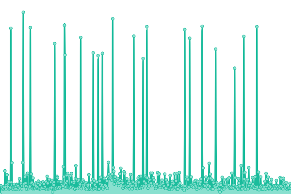
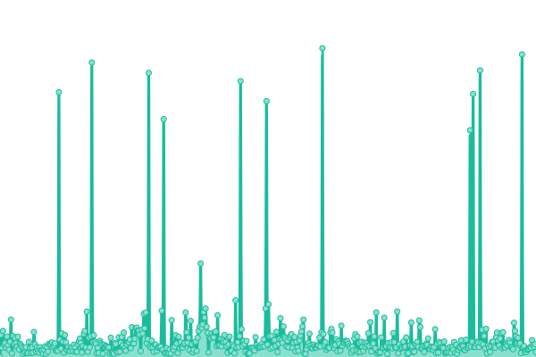

# [📈 Live Status](https://status.geekcorner.eu.org): <!--live status--> **🟧 Partial outage**

This repository contains the open-source uptime monitor and status page for [Upptime](https://upptime.js.org), powered by [Upptime](https://github.com/upptime/upptime).

With [Upptime](https://upptime.js.org), you can get your own unlimited and free uptime monitor and status page, powered entirely by a GitHub repository. We use [Issues](https://github.com/upptime/upptime/issues) as incident reports, [Actions](https://github.com/GeekCornerGH/status-page/actions) as uptime monitors, and [Pages](https://status.geekcorner.eu.org) for the status page.

<!--start: status pages-->
<!-- This summary is generated by Upptime (https://github.com/upptime/upptime) -->
<!-- Do not edit this manually, your changes will be overwritten -->
<!-- prettier-ignore -->
| URL | Status | History | Response Time | Uptime |
| --- | ------ | ------- | ------------- | ------ |
|  Bitwarden | En ligne | [bitwarden.yml](https://github.com/GeekCornerGH/status-page/commits/HEAD/history/bitwarden.yml) | 

 1199ms
     
 | 

<a href="https://status.geekcorner.eu.org/history/bitwarden">100.00%</a>
    

|  Mastodon | Innaccessible | [mastodon.yml](https://github.com/GeekCornerGH/status-page/commits/HEAD/history/mastodon.yml) | 

 0ms
     
 | 

<a href="https://status.geekcorner.eu.org/history/mastodon">0.00%</a>
    

|  Hastebin | En ligne | [hastebin.yml](https://github.com/GeekCornerGH/status-page/commits/HEAD/history/hastebin.yml) | 

 777ms
     
 | 

<a href="https://status.geekcorner.eu.org/history/hastebin">100.00%</a>
    

<!--end: status pages-->

[**Visit our status website →**](https://status.geekcorner.eu.org)

## 📄 License

- Powered by: [Upptime](https://github.com/upptime/upptime)
- Code: [MIT](./LICENSE) © [Upptime](https://upptime.js.org)
- Data in the `./history` directory: [Open Database License](https://opendatacommons.org/licenses/odbl/1-0/)
